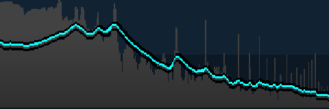

<h1>
x-spectrum <a href="https://npmjs.org/package/x-spectrum"></a> <a href="src"></a> <a href="https://cdn.jsdelivr.net/npm/x-spectrum@1.0.1/dist/x-spectrum.min.js"></a> <a href="LICENSE"></a>
</h1>

<p></p>

Audio spectrum analyser Web Component

<h4>
<table><tr><td title="Triple click to select and copy paste">
<code>npm i x-spectrum </code>
</td><td title="Triple click to select and copy paste">
<code>pnpm add x-spectrum </code>
</td><td title="Triple click to select and copy paste">
<code>yarn add x-spectrum</code>
</td></tr></table>
</h4>

## Examples

<details id="example$web" title="web" open><summary><span><a href="#example$web">#</a></span>  <code><strong>web</strong></code></summary>  <ul><p></p>  <a href="https://stagas.github.io/x-spectrum/example/web.html"></img>  <p><strong>Try it live</strong></p></a>    <details id="source$web" title="web source code" ><summary><span><a href="#source$web">#</a></span>  <code><strong>view source</strong></code></summary>  <a href="example/web.ts">example/web.ts</a>  <p>

```ts
import { fetchAudioBuffer } from 'webaudio-tools'
import { SpectrumElement } from 'x-spectrum'

customElements.define('x-spectrum', SpectrumElement)
document.body.innerHTML = `
<div id="demo" style="display:inline-flex;height:80px;">
  <x-spectrum autoresize></x-spectrum>
</div>
`

const ctx = new AudioContext({ sampleRate: 44100, latencyHint: 'playback' })

const analyser = ctx.createAnalyser()
analyser.fftSize = 16384
analyser.smoothingTimeConstant = 0
analyser.maxDecibels = 0
analyser.minDecibels = -100

// @ts-ignore
const url = new URL('alpha_molecule.ogg', import.meta.url).toString()

fetchAudioBuffer(ctx, url).then(audioBuffer => {
  const source = ctx.createBufferSource()
  source.buffer = audioBuffer
  source.loop = true
  source.connect(ctx.destination)
  source.start(0, 75)
  source.connect(analyser)
  ;(document.querySelector('x-spectrum') as SpectrumElement).analyser = analyser
})

window.onclick = () => ctx.state !== 'running' ? ctx.resume() : ctx.suspend()
if (ctx.state !== 'running')
  document.body.appendChild(new Text('click to start/stop'))
```

</p>
</details></ul></details>

## API

<p>  <details id="SpectrumElement$1" title="Class" open><summary><span><a href="#SpectrumElement$1">#</a></span>  <code><strong>SpectrumElement</strong></code>    </summary>  <a href="src/x-spectrum.ts#L27">src/x-spectrum.ts#L27</a>  <ul>        <p>  <details id="constructor$3" title="Constructor" ><summary><span><a href="#constructor$3">#</a></span>  <code><strong>constructor</strong></code><em>()</em>    </summary>    <ul>    <p>  <details id="new SpectrumElement$4" title="ConstructorSignature" ><summary><span><a href="#new SpectrumElement$4">#</a></span>  <code><strong>new SpectrumElement</strong></code><em>()</em>    </summary>    <ul><p><a href="#SpectrumElement$1">SpectrumElement</a></p>        </ul></details></p>    </ul></details><details id="analyser$15" title="Property" ><summary><span><a href="#analyser$15">#</a></span>  <code><strong>analyser</strong></code>    </summary>  <a href="src/x-spectrum.ts#L50">src/x-spectrum.ts#L50</a>  <ul><p><span>AnalyserNode</span></p>        </ul></details><details id="autoResize$5" title="Property" ><summary><span><a href="#autoResize$5">#</a></span>  <code><strong>autoResize</strong></code>  <span><span>&nbsp;=&nbsp;</span>  <code>false</code></span>  </summary>  <a href="src/x-spectrum.ts#L32">src/x-spectrum.ts#L32</a>  <ul><p>boolean</p>        </ul></details><details id="background$13" title="Property" ><summary><span><a href="#background$13">#</a></span>  <code><strong>background</strong></code>  <span><span>&nbsp;=&nbsp;</span>  <code>'#123'</code></span>  </summary>  <a href="src/x-spectrum.ts#L44">src/x-spectrum.ts#L44</a>  <ul><p>string</p>        </ul></details><details id="color$14" title="Property" ><summary><span><a href="#color$14">#</a></span>  <code><strong>color</strong></code>  <span><span>&nbsp;=&nbsp;</span>  <code>'#1ff'</code></span>  </summary>  <a href="src/x-spectrum.ts#L45">src/x-spectrum.ts#L45</a>  <ul><p>string</p>        </ul></details><details id="gradientColors$28" title="Property" ><summary><span><a href="#gradientColors$28">#</a></span>  <code><strong>gradientColors</strong></code>  <span><span>&nbsp;=&nbsp;</span>  <code>...</code></span>  </summary>  <a href="src/x-spectrum.ts#L66">src/x-spectrum.ts#L66</a>  <ul><p>{<p>  <details id="0.3$30" title="Property" ><summary><span><a href="#0.3$30">#</a></span>  <code><strong>0.3</strong></code>  <span><span>&nbsp;=&nbsp;</span>  <code>'#424242'</code></span>  </summary>    <ul><p>string</p>        </ul></details><details id="1$31" title="Property" ><summary><span><a href="#1$31">#</a></span>  <code><strong>1</strong></code>  <span><span>&nbsp;=&nbsp;</span>  <code>'#2f2f2f'</code></span>  </summary>    <ul><p>string</p>        </ul></details></p>}</p>        </ul></details><details id="gravity$12" title="Property" ><summary><span><a href="#gravity$12">#</a></span>  <code><strong>gravity</strong></code>  <span><span>&nbsp;=&nbsp;</span>  <code>0.05</code></span>  </summary>  <a href="src/x-spectrum.ts#L42">src/x-spectrum.ts#L42</a>  <ul><p>number</p>        </ul></details><details id="height$7" title="Property" ><summary><span><a href="#height$7">#</a></span>  <code><strong>height</strong></code>  <span><span>&nbsp;=&nbsp;</span>  <code>50</code></span>  </summary>  <a href="src/x-spectrum.ts#L35">src/x-spectrum.ts#L35</a>  <ul><p>number</p>        </ul></details><details id="maxFreq$10" title="Property" ><summary><span><a href="#maxFreq$10">#</a></span>  <code><strong>maxFreq</strong></code>  <span><span>&nbsp;=&nbsp;</span>  <code>21000</code></span>  </summary>  <a href="src/x-spectrum.ts#L39">src/x-spectrum.ts#L39</a>  <ul><p>number</p>        </ul></details><details id="minFreq$9" title="Property" ><summary><span><a href="#minFreq$9">#</a></span>  <code><strong>minFreq</strong></code>  <span><span>&nbsp;=&nbsp;</span>  <code>62</code></span>  </summary>  <a href="src/x-spectrum.ts#L38">src/x-spectrum.ts#L38</a>  <ul><p>number</p>        </ul></details><details id="pixelRatio$8" title="Property" ><summary><span><a href="#pixelRatio$8">#</a></span>  <code><strong>pixelRatio</strong></code>  <span><span>&nbsp;=&nbsp;</span>  <code>window.devicePixelRatio</code></span>  </summary>  <a href="src/x-spectrum.ts#L36">src/x-spectrum.ts#L36</a>  <ul><p>number</p>        </ul></details><details id="speed$11" title="Property" ><summary><span><a href="#speed$11">#</a></span>  <code><strong>speed</strong></code>  <span><span>&nbsp;=&nbsp;</span>  <code>0.03</code></span>  </summary>  <a href="src/x-spectrum.ts#L41">src/x-spectrum.ts#L41</a>  <ul><p>number</p>        </ul></details><details id="width$6" title="Property" ><summary><span><a href="#width$6">#</a></span>  <code><strong>width</strong></code>  <span><span>&nbsp;=&nbsp;</span>  <code>150</code></span>  </summary>  <a href="src/x-spectrum.ts#L34">src/x-spectrum.ts#L34</a>  <ul><p>number</p>        </ul></details><details id="start$41" title="Method" ><summary><span><a href="#start$41">#</a></span>  <code><strong>start</strong></code><em>()</em>     &ndash; Start displaying the spectrum.</summary>  <a href="src/x-spectrum.ts#L80">src/x-spectrum.ts#L80</a>  <ul>    <p>      <p><strong>start</strong><em>()</em>  &nbsp;=&gt;  <ul>void</ul></p></p>    </ul></details><details id="stop$43" title="Method" ><summary><span><a href="#stop$43">#</a></span>  <code><strong>stop</strong></code><em>()</em>     &ndash; Stop displaying the spectrum.</summary>  <a href="src/x-spectrum.ts#L86">src/x-spectrum.ts#L86</a>  <ul>    <p>      <p><strong>stop</strong><em>()</em>  &nbsp;=&gt;  <ul>void</ul></p></p>    </ul></details></p></ul></details></p>

## Credits

- [mixter](https://npmjs.org/package/mixter) by [stagas](https://github.com/stagas) &ndash; A Web Components framework.
- [webaudio-tools](https://npmjs.org/package/webaudio-tools) by [stagas](https://github.com/stagas) &ndash; useful tools for webaudio

## Contributing

[Fork](https://github.com/stagas/x-spectrum/fork) or [edit](https://github.dev/stagas/x-spectrum) and submit a PR.

All contributions are welcome!

## License

<a href="LICENSE">MIT</a> &copy; 2022 [stagas](https://github.com/stagas)
